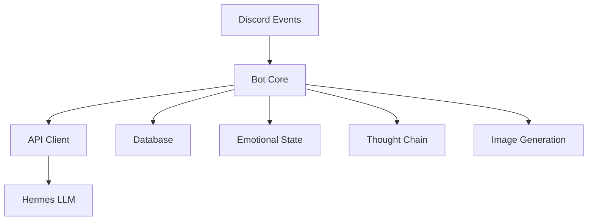

# Cleo - Discord Bot for Nous Research Bots

## Overview

Cleo is an advanced Discord bot powered by the Nous Research Hermes LLM. It features dynamic conversation management, emotional intelligence, and image generation capabilities, all while maintaining a friendly and engaging personality.

## Core Components

### 1. Bot Core (`src/bot.py`)

Handles the main bot implementation for Discord events and message processing.

**Key Features:**

- Message handling and response generation
- Thought chain management
- Image generation integration
- Dynamic response formatting

### 2. API Client (`src/api_client.py`)

Manages communication with the Hermes LLM API.

**Features:**

- Rate-limited API requests
- Context management
- Error handling and retries
- Response parameter optimization

### 3. Database Management (`src/database.py`)

SQLite-based persistence layer for:

- Conversation history
- User profiles
- Message context
- Channel-specific data

### 4. Emotional State System (`src/emotional_state.py`)

Tracks and manages Cleo's emotional responses.

**Features:**

- Mood tracking
- Sentiment analysis
- Response parameter adjustment
- User interaction history

### 5. Thought Chain Management (`src/thought_chain.py`)

Handles complex conversation flows.

**Features:**

- Multi-turn conversations
- Context continuation
- Natural interruptions
- Response coherence

### 6. Image Generation (`src/flux.py`)

Integrates with an image generation API.

**Features:**

- Prompt processing
- Image generation requests
- Error handling
- Response formatting

## System Architecture



## Key Features

### 1. Context-Aware Conversations

- Maintains conversation history
- Understands context across messages
- Handles multiple concurrent conversations

### 2. Emotional Intelligence

- Adapts tone based on user interaction
- Maintains a consistent personality
- Provides empathetic responses

### 3. Dynamic Response Generation

- Natural language processing
- Context-aware replies
- Multi-turn conversation support

### 4. Image Generation

- Integrated image creation
- Prompt processing
- Visual response capabilities

## Configuration

The bot uses environment variables for configuration. Ensure to set these variables for secure and proper functioning.

## Module Dependencies

### Core Dependencies

- `discord.py`
- `aiohttp`
- `aiosqlite`
- `python-dotenv`

### Optional Dependencies

- `matplotlib` (for metrics)
- `pillow` (for image processing)

## Setup and Installation

1. Clone the repository:

   ```bash
   git clone https://github.com/username/cleo-discord-bot.git
   ```

2. Navigate to the project directory:

   ```bash
   cd cleo-discord-bot
   ```

3. Install the required dependencies:

   ```bash
   pip install -r requirements.txt
   ```

4. Configure environment variables by creating a `.env` file.

5. Run the bot:

   ```bash
   python src/bot.py
   ```

## Error Handling

The system includes comprehensive error handling mechanisms:

- API rate limiting
- Connection retries
- Database transaction management
- Exception logging

## Conversation Flow

1. **Message Reception**
2. **Context Loading**
3. **Emotional State Analysis**
4. **Response Generation**
5. **Thought Chain Processing**
6. **Response Delivery**

## Development Guidelines

### 1. Code Structure

- Modular design
- Clear separation of concerns
- Comprehensive error handling

### 2. Performance Optimization

- Efficient database queries
- Rate limiting
- Resource management

### 3. Maintainability

- Clear documentation
- Type hints
- Consistent coding style

## Contributing

1. Fork the repository.
2. Create a feature branch.
3. Submit a pull request.

## License

This project is licensed under the MIT License. See the `LICENSE` file for more details.

## Support

For issues and feature requests, please use the GitHub issue tracker.
